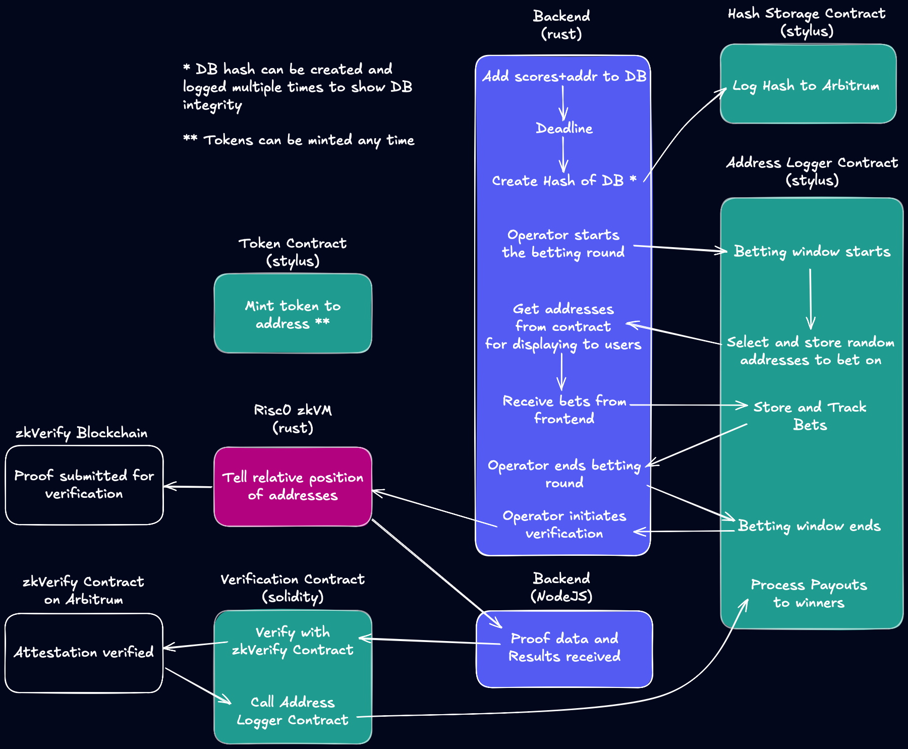

# zkLeaderboard

A web3 gaming infrastructure demonstrating secure leaderboard and betting functionality using zero-knowledge proofs. The system enables trustless score verification and betting on player rankings through zkVerify's proof verification network.

## System Architecture



## Project Structure

```
zkLeaderboard_app/
├── frontend/               # Next.js web application
├── rust/
│   ├── backend/           # Rust API server for address generation and management
│   ├── prover/            # Risc0 zkVM prover implementation
│   └── contracts/         # Arbitrum Stylus smart contracts
└── solidity_contracts/
    └── verification/      # Ethereum verification prize contracts
```

## Components

### Frontend

- Next.js web application with wallet integration
- Interactive betting interface
- Real-time proof generation and verification
- Full documentation in `frontend/README.md`

### Rust Backend

- Address generation and management API
- SQLite database for address storage
- Smart contract integration services
- Details in `rust/backend/README.md`

### Risc0 Prover

- Zero-knowledge proof generation
- Score verification logic
- Details in `rust/prover/README.md`

### Smart Contracts

- Stylus Contracts (Rust):
  - Address logging and betting management
  - ERC20 token integration
  - Details in `rust/contracts/README.md`
- Solidity Contracts:
  - Verification prize distribution
  - Details in `solidity_contracts/verification/README.md`

## Getting Started

1. Set up environment variables in each component:

   - Copy `.env.example` files and configure as needed
   - Ensure you have required API keys and wallet credentials

2. Start the backend:

```bash
cd rust/backend
cargo run
```

3. Start the frontend:

```bash
cd frontend
npm install
npm run dev
```

4. For contract deployment and interaction, refer to respective README files in contract directories.

## Prerequisites

- Node.js v20+
- Rust (latest stable)
- SQLite
- Web3 wallet with testnet tokens
- Substrate wallet for zkVerify

## Network Requirements

- Arbitrum Sepolia testnet for Stylus contracts
- zkVerify testnet for proof verification
- Access to testnet RPC endpoints

## Documentation

Each component contains its own detailed README with specific setup instructions and documentation.

## License

This project is licensed under the Apache License 2.0.
